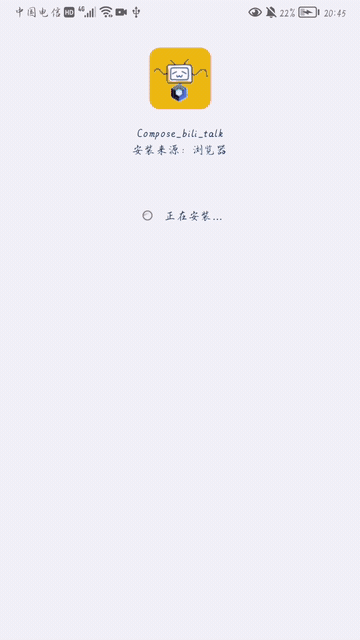
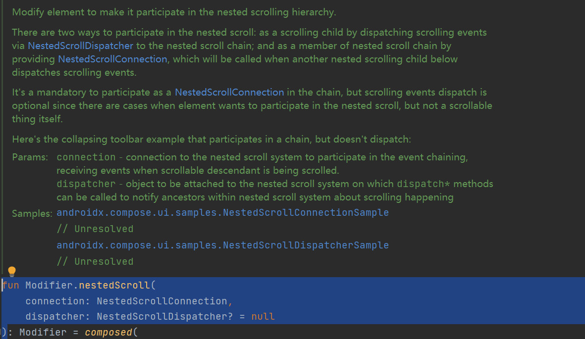
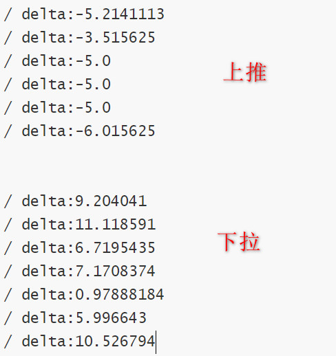
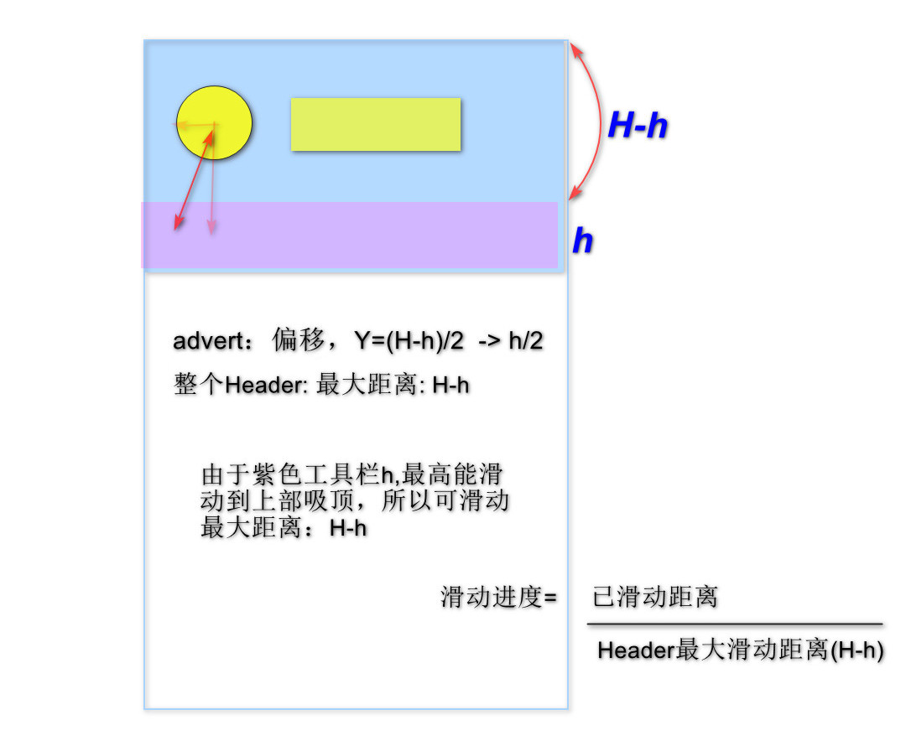
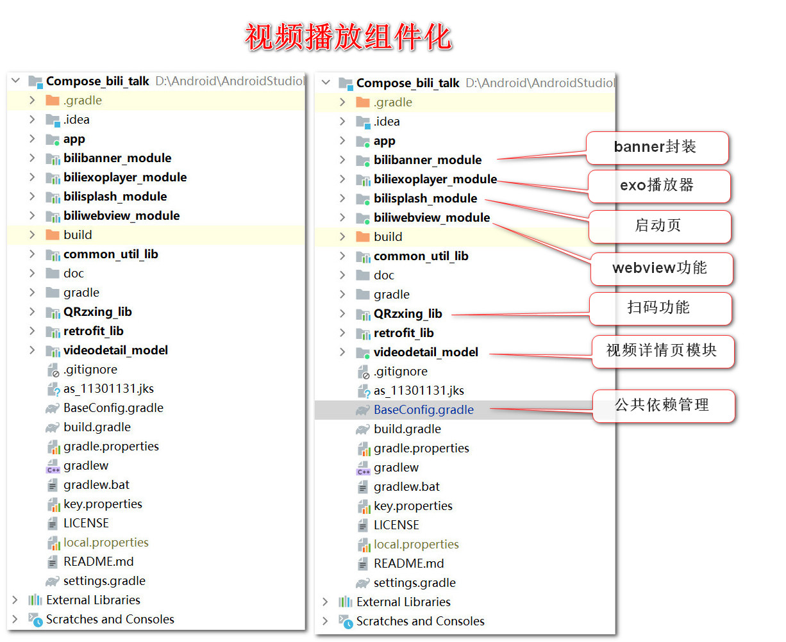

接触Compose一段时间了，作为练手写了一个类似bilibili的小应用，模块包含：

* 首页列表
* 详情播放，评论点赞
* 启动页
* 登录注册
* 嵌套滑动布局
* 扫码识别

延误了一段时间，尽管不完善但是总算可以分享出来了。


**上一篇文章中主要记录了登录注册页面和路由框架的实现 →**  

[Jetpack Compose | 低仿哔哩哔哩（一）|尝试实现 登录注册| 首页骨架]: https://juejin.cn/post/7036674714915471373


效果图：

   


## 一、启动页的实现：

1. 首先要定义页面路由，将初始路由startDestination定义为启动页SplashScreen.
2. 然后在启动页加入动画等动效，期间可以做点别的事，比如请求广告图片，鉴权判断token是否存在，登录是否过期，如果需要重新登录就Navigation到LoginScreen,否则跳转到主页MainScreen.
3. 这里我的启动页没有什么特别之处，只是添加了一些动效。

* viewModel中维护一些状态变量，用来标记动画状态，这里做的比较简单，检查本地登录口令是否存在，不存在就需要重新登录：

```kotlin
class SplashViewModel : ViewModel() {

    var isEndTask by mutableStateOf(false)
    var checkingLoginState = mutableStateOf(false)
    var loginState by mutableStateOf(-1)

    // 检查登录
    private fun checkLogin() {
        checkingLoginState.value = true
        viewModelScope.launch {

            // 查询登录令牌是否已保存来模拟判断是否已经登录
            flow {
                delay(5000) // 单纯为了动画执行做了延迟
                val boardingPass = DataStoreUtil.readStringData(BOARDING_PASS)
                val result = if (boardingPass.isBlank()) 0 else 1
                emit(result)
            }.flowOn(Dispatchers.IO).collect {
                Log.d("splash--:", "loginState:$it")
                loginState = it
                checkingLoginState.value = false
            }
        }
    }

    fun checkLoginState() {
        viewModelScope.launch {
            delay(1000)
            checkLogin()
            isEndTask = true
        }
    }
}
```

* 启动页除了动画之外，没有特别的功能

```kotlin
/**
* 启动页入口
* @param navNexEvent 下一步动作回调方法，跳转登录或者主页
*/
@ExperimentalAnimationApi
@Composable
fun SplashScreen(
    splashViewModel: SplashViewModel,
    navNexEvent: (Boolean) -> Unit
) {
    Box(
        modifier = Modifier
            .fillMaxSize()
            .navigationBarsPadding()
            .background(MaterialTheme.colors.background),
    ) {
        splashViewModel.checkLoginState()

        // 大背景图片
        SplashBgOne()

        Column(
            modifier = Modifier
                .animateContentSize()
                .wrapContentSize()
                .align(Alignment.BottomCenter),
            horizontalAlignment = Alignment.CenterHorizontally
        ) {
            Row(
                modifier = Modifier
                    .wrapContentHeight(),
                verticalAlignment = Alignment.CenterVertically
            ) {
                // coil加载小人儿图片
                CoilImage(
                    modifier = Modifier
                        .width(50.dp)
                        .height(115.dp),
                    url = R.drawable.bili_man
                )
                Column(
                    modifier = Modifier.background(
                        // 此处是一个线性渐变背景
                        brush = Brush.verticalGradient(
                            colorStops = arrayOf(
                                0.0f to Color.White,
                                0.2f to bili_20,
                                0.5f to Color.Transparent,
                                0.7f to Color.White,
                                0.9f to Color.Transparent
                            )
                        )
                    )
                ) {
                    Text(
                        modifier = Modifier.padding(start = 5.dp),
                        text = "Bili...",
                        fontSize = 35.sp,
                        fontWeight = FontWeight.Bold,
                        color = MaterialTheme.colors.onBackground
                    )
                    Text(
                        modifier = Modifier.padding(start = 5.dp, bottom = 6.dp),
                        text = "https://www.bilibili.com",
                        fontSize = 20.sp,
                        color = Color.Gray.copy(alpha = 0.7f),
                        fontStyle = FontStyle.Italic
                    )
                }
            }
            Spacer(modifier = Modifier.height(28.dp))

            // 被AnimatedVisibility包裹的内容，会根据设置的visible条件展示/隐藏
            AnimatedVisibility(
                visible = splashViewModel.checkingLoginState.value,
                modifier = Modifier
                    .padding(top = 20.dp)

            ) {
                Column(horizontalAlignment = Alignment.CenterHorizontally) {
                    LinearProgressIndicator(
                        modifier = Modifier.width(150.dp)
                    )
                    Spacer(modifier = Modifier.height(20.dp))
                    Text(text = "检查登录状态...")
                    Spacer(modifier = Modifier.height(20.dp))
                }
            }
        }
    }
    // LaunchedEffect启动一个协程作用域
    LaunchedEffect(
        splashViewModel.loginState,
        splashViewModel.checkingLoginState
    ) {
        if (splashViewModel.loginState != -1 && !splashViewModel.checkingLoginState.value) {
            // 处理下一步
            navNexEvent(splashViewModel.loginState == 1)
        }
    }
}

@ExperimentalAnimationApi
@Composable
fun SplashBgOne() {
    // 先来创建三个动画空间
    val alphaAnim = remember {
        Animatable(0f)
    }
    val cornerAnim = remember {
        Animatable(50f)
    }
    val scaleAnim = remember {
        Animatable(0.2f)
    }

    
    LaunchedEffect(key1 = true) {
        // 给大背景加入渐出动画  
        alphaAnim.animateTo(targetValue = 1.0f,              
            animationSpec = tween(
                durationMillis = 500,
                easing = {
                    OvershootInterpolator(0.8f).getInterpolation(it)
                }
            )
        )
        // 给大背景加入圆角动画  
        cornerAnim.animateTo(targetValue = 1.0f,
            animationSpec = tween(
                durationMillis = 500,
                easing = {
                    OvershootInterpolator(0.8f).getInterpolation(it)
                }
            )
        )
        // 给大背景加入缩放动画
        scaleAnim.animateTo(targetValue = 1.0f,
            animationSpec = tween(
                durationMillis = 300,
                easing = {
                    OvershootInterpolator(0.6f).getInterpolation(it)
                }
            )
        )
    }
    // 给图片加上属性，值来源于对应的动画值
    Image(
        modifier = Modifier
            .fillMaxWidth()
            .fillMaxSize()
            .scale(scaleAnim.value)
            .alpha(alpha = alphaAnim.value)
            .clip(shape = RoundedCornerShape(1.dp.times(cornerAnim.value.toInt()))),
        //.align(Alignment.Center),
        painter = painterResource(id = R.drawable.splash_pic),
        contentScale = ContentScale.FillBounds,
        contentDescription = null
    )
}

```


### 二、个人中心界面滑动动效：

​     页面滑动嵌套，官方提供了一个Modifier即nestedScroll()来处理滑动，通过它可以监听滑动进度和滑动方向。Google去年就有计划完善Compose的文档，最新的文档应该更加完善了，官方还提供了Samples:



​     简单用法如下，available保存了滑动的单步距离，通过测试日志发现了该变量的值与滑动方向的关系，如下：

```kotlin
// 创建与嵌套滚动系统的连接nestedScrollConnection,监听LazyColumn 中的滚动
val nestedScrollConnection = remember {
            object : NestedScrollConnection {
                override fun onPreScroll(
                    available: Offset,
                    source: NestedScrollSource
                ): Offset {
                    val delta = available.y
                    oLog("scroll: delta:$delta")
                    // 累加LazyColumn滑动距离
                    val newOffset = slideOffsetHeightPx.value + delta
                    slideOffsetHeightPx.value = newOffset.coerceIn(-maxUpPx, minUpPx)
                    return Offset.Zero
                }
            }
}
// 父滑动列表
Box(
    Modifier
   .fillMaxSize()
   .nestedScroll(nestedScrollConnection)
   ) {
            ...// 列表布局，比如LazyColumn
}
```




然后，知道了每一步的距离，就可以得到累加滑动距离，还可以算出实时滑动进度，

然后根据进度与某部件的最大滑动距离，即可实时偏移部件位置或尺寸：



基于此，简单封装了一下，根据滑动进度调整控件位置，而调整控件位置这里是通过给它动态设置offset偏移量来达到的。

封装位于项目中的文件：

**NestedWrapCustomLayout.kt**   整个Header部分

**ScrollableAppBar.kt**   Header中的横条信息栏

使用：

```kotlin
/**
* 个人中心
*/
@Composable
fun ProfileContentScreen(
    coroutineScope: CoroutineScope,
    viewModel: ProfileViewModel,
    columnLazyState: LazyListState,
    profileData: DataProfile
) {
    Scaffold(
        modifier = Modifier
            .fillMaxSize()
    ) {
        var isShowDialog by remember { mutableStateOf(false) }

        val navController = LocalNavController.current
        // 封装的滑动布局
        NestedWrapCustomLayout(
            columnTop = 202.dp,
            navigationIconSize = 80.dp,
            toolBarHeight = 56.dp,
            scrollableAppBarHeight = 202.dp,
            columnState = columnLazyState,
            scrollableAppBarBgColor = Color.LightGray,
            toolBar = { ProfileToolBar(profileData = profileData) },
            navigationIcon = { UserAdvertImg(advert = profileData.face) }, //默认为返回图标
            extendUsrInfo = { UserNameUI(profileData = profileData) },
            headerTop = { HeaderTop() },
            backSlideProgress = { progress ->

            }
        ) {
            // 这里有滑动布局空间LazyListScope，所以可以直接给封装布局中的LazyColumn添加item

            /** 1. 广告banner */
            item {
                BiliBanner(
                    modifier = Modifier
                        .fillMaxWidth()
                        .advancedShadow(
                            color = gray200,
                            alpha = 0.8f,
                            shadowBlurRadius = 10.dp,
                            offsetX = 2.dp,
                            offsetY = 3.dp
                        ),
                    items = viewModel.bannerDataList,
                    config = BannerConfig(
                        indicatorColor = Color.White.copy(0.8f),
                        selectedColor = bili_50.copy(0.8f),
                        intervalTime = 3000
                    ),

                    itemOnClick = { banner ->
                        // 点击banner
                        coroutineScope.launch {
                            NavUtil.doPageNavigationTo(
                                navController,
                                PageRoute.WEB_VIEW_ROUTE.replaceAfter("=", banner.url)
                            )
                        }
                    }
                )
            }

            /** 2. 广告课程 */
            stickyHeader {
                ColumnStickHeader(title = "你的广告", subTitle = "这些都是flutter课程广告")
            }
            profileData.courseList?.let {
                item {
                    CourseListView(courseList = it)
                }
            }
            // ...其他项目
        }
    }
```


### 三、自定义二维码扫码界面动效

​    扫码这里我用到了zxing和camera，先引入依赖库：

```groovy
    // Camera
    implementation "androidx.camera:camera-camera2:1.0.2"
    implementation "androidx.camera:camera-lifecycle:1.0.2"
    implementation "androidx.camera:camera-view:1.0.0-alpha31"
    // Zxing
    implementation 'com.google.zxing:core:3.4.1'
```

   首先需要申请相机权限，其次定义一个图像解析器，继承camera库的ImageAnalysis.Analyzer，重写其方法analyze()；

其中PlanarYUVLuminanceSource 优化了相机驱动返回的YUV数据，主要是去除冗余数据达到加速解码。

```kotlin
class QrCodeAnalyzer(
    private val onQrCodeScanned: (String) -> Unit
) : ImageAnalysis.Analyzer {

    private val supportedImageFormats = listOf(
        ImageFormat.YUV_420_888,
        ImageFormat.YUV_422_888,
        ImageFormat.YUV_444_888,
    )

    override fun analyze(image: ImageProxy) {
        if (image.format in supportedImageFormats) {
            val bytes = image.planes.first().buffer.toByteArray()

            val source = PlanarYUVLuminanceSource(
                bytes,
                image.width,
                image.height,
                0,
                0,
                image.width,
                image.height,
                false
            )
            val binaryBitmap = BinaryBitmap(HybridBinarizer(source))
            try {
                val result = MultiFormatReader().apply {
                    setHints(
                        mapOf(
                            DecodeHintType.POSSIBLE_FORMATS to arrayListOf(
                                BarcodeFormat.QR_CODE
                            )
                        )
                    )
                }.decode(binaryBitmap)
                // 为了回调结果
                onQrCodeScanned(result.text)
            } catch (e: Exception) {
                e.printStackTrace()
            } finally {
                image.close()
            }
        }
    }

    private fun ByteBuffer.toByteArray(): ByteArray {
        rewind()
        return ByteArray(remaining()).also {
            get(it)
        }
    }
}
```

在Compose中使用zxing扫描，这里涉及Compose与View体系的交互，Compose中使用View要用到AndroidView(),它自己本身也是一个Compose：

```kotlin
      AndroidView(
                modifier = Modifier.fillMaxSize(),
                factory = { context ->
                    val previewView = PreviewView(context)
                    val preview = Preview.Builder().build()
                    val selector = CameraSelector.Builder()
                        .requireLensFacing(CameraSelector.LENS_FACING_BACK)
                        .build()
                    preview.setSurfaceProvider(previewView.surfaceProvider)
                    val imageAnalysis = ImageAnalysis.Builder()
                        .setTargetResolution(
                            Size(previewView.width, previewView.height)
                        )
                        .setBackpressureStrategy(STRATEGY_KEEP_ONLY_LATEST).build()
                    imageAnalysis.setAnalyzer(
                        ContextCompat.getMainExecutor(context),
                        QrCodeAnalyzer { result ->
                            // 得到解析结果            
                            code = result
                        }
                    )

                    try {
                        cameraProviderFuture.get().bindToLifecycle(
                            lifecycleOwner,
                            selector,
                            preview,
                            imageAnalysis
                        )
                    } catch (e: Exception) {
                        e.printStackTrace()
                    }
                    previewView
                },
            )
```

扫描动效界面也是一个加入了动画的Composable，将背景设置为透明，置于相机之上，监听zxing图像解析结果。

### 四、搜索页面注意点

  搜索页面主要涉及输入框自动获焦，页面状态管理。

1. 首先定义键盘管理器，焦点请求处理器：

```kotlin
val keyboardController = LocalSoftwareKeyboardController.current
val focusRequester = FocusRequester()
```

2. 其次,Modifier设置自动焦点请求，传入焦点请求处理器，然后onFocusChanged{}监听焦点变化，如果获焦则展示软键盘。

```kotlin
 TextField(
       modifier = Modifier
                .focusRequester(focusRequester)
                .onFocusChanged {
                    if (it.isFocused) {
                       keyboardController?.show()
                    }
                 }
                 .wrapContentHeight()
                 .width(210.dp),
        value = inputValue,
        // 监听输入变化，主动调用搜索
        onValueChange = {
            inputValue = it
            onSearch(inputValue)
        },
       // .....
     )
```

3. 最后，输入完成时触发隐藏软键盘：

```kotlin
keyboardActions = KeyboardActions(onSearch = {
      onSearch(inputValue)
      keyboardController?.hide()
}),
```

综上，搜索顶部输入框的整体处理代码如下：

```kotlin
/**
 * 搜索输入框
 * */
@ExperimentalComposeUiApi
@Composable
fun SearchTopBar(
    needInputNow: String,
    onSearch: (String) -> Unit,
    onCancel: () -> Unit,
    onClearInput: () -> Unit
) {
    var inputValue by remember { mutableStateOf("") }

    if (needInputNow.isNotEmpty()) {
        inputValue = needInputNow
    }

    Row(
        modifier = Modifier
            .padding(horizontal = 16.dp)
            .fillMaxWidth()
            .height(48.dp)
            .background(color = Color.White, shape = RectangleShape),
        verticalAlignment = Alignment.CenterVertically
    ) {
        // 用来管理软键盘
        val keyboardController = LocalSoftwareKeyboardController.current
        val focusRequester = FocusRequester()

        Row(
            modifier = Modifier
                .width(320.dp)
                .background(color = gray200, shape = RoundedCornerShape(24.dp))
                .padding(end = 8.dp, start = 16.dp),
            verticalAlignment = Alignment.CenterVertically
        ) {
            Icon(
                modifier = Modifier
                    .size(36.dp)
                    .padding(start = 8.dp),
                imageVector = Icons.Rounded.Search,
                contentDescription = "search",
                tint = Color.Gray
            )
            TextField(
                modifier = Modifier
                    .focusRequester(focusRequester)
                    .onFocusChanged {
                        if (it.isFocused) {
                            keyboardController?.show()
                        }
                    }
                    .wrapContentHeight()
                    .width(210.dp),
                value = inputValue,
                onValueChange = {
                    inputValue = it
                    onSearch(inputValue)
                },
                placeholder = {
                    Text(
                        text = "面粉社长",
                        style = TextStyle(fontSize = 14.sp)
                    )
                },
                colors = TextFieldDefaults.textFieldColors(
                    cursorColor = bili_50,
                    // 将指示器所有状态颜色都设置透明
                    focusedIndicatorColor = Color.Transparent,
                    disabledIndicatorColor = Color.Transparent,
                    unfocusedIndicatorColor = Color.Transparent,
                    backgroundColor = gray200
                ),
                // 完成时动作自定义处理
                keyboardActions = KeyboardActions(onSearch = {
                    onSearch(inputValue)
                    keyboardController?.hide()
                }),
                textStyle = TextStyle(color = gray400),
                // 会指定一个按钮，比如Search, Done,等等
                keyboardOptions = KeyboardOptions.Default.copy(
                    imeAction = ImeAction.Search
                )
            )
            // 这里设计为：如果有输入文字，展示清除按钮
            if (inputValue.isNotEmpty()) {
                IconButton(
                    modifier = Modifier
                        .padding(4.dp),
                    onClick = {
                        inputValue = ""
                        onClearInput()
                    },
                ) {
                    Icon(
                        modifier = Modifier
                            .size(28.dp)
                            .background(
                                color = gray300.copy(alpha = 0.3f),
                                shape = CircleShape
                            ),
                        imageVector = Icons.Rounded.Clear,
                        contentDescription = "clear",
                        tint = gray400
                    )
                }
            }
        }

        DisposableEffect(Unit) {
            focusRequester.requestFocus()
            onDispose { }
        }

        TextButton(
            modifier = Modifier
                .padding(start = 4.dp)
                .wrapContentSize(),
            onClick = { onCancel() },
            contentPadding = PaddingValues(5.dp),
            colors = ButtonDefaults.textButtonColors(contentColor = Color.White)
        ) {
            Text(text = "取消", fontSize = 18.sp, color = Color.Gray)
        }

    }
}
```


### 五、视频播放

关于视频播放部分，之前有文章分享过Compose中如何进行视频播放。

[【参考链接】]: https://juejin.cn/post/7034363130121551903

另外，列表分页加载使用了Paging分页框架。

[【参考链接】]: https://juejin.cn/post/7032954701071155213


------

代码结构：

拆分比较随意，仅仅是处于方便查找，按功能划分小模块。




### 本文源码：

[github链接 - Compose]: https://github.com/Jesen0823/Compose_bili_talk/tree/basic_v1.0
[github链接 - Flutter]:https://github.com/Jesen0823/flutter_bili_talk/tree/br_componentization


